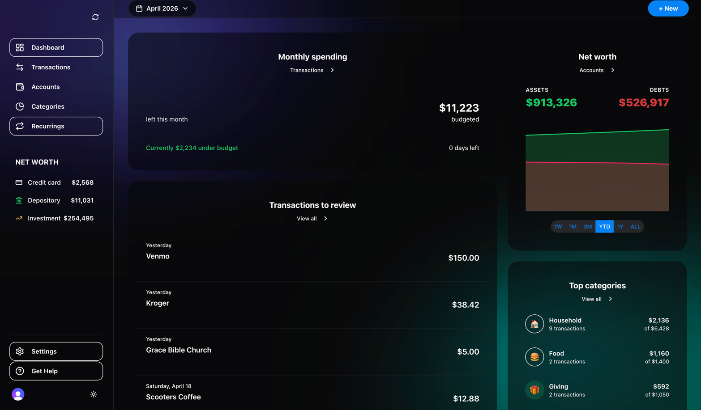

# 💸 Monai — Financial Dashboard



> A blazing-fast, local-first financial dashboard. Privacy-first. AI-powered. Copilot Money vibes, minus the subscription.

---

## ✨ Features

| Feature | Description |
|---|---|
| 📊 **Dashboard** | Net worth chart, budget progress, top categories at a glance |
| 🔄 **Transaction Review** | Pulse-animated queue of transactions begging for your attention |
| 🤖 **AI Categorization** | Cursor CLI auto-tags your merchants so you don't have to |
| ⏳ **Time Travel** | Jump to any past month to audit your past-self's spending crimes |
| 🏦 **Account Groups** | Credit, Depository, Investment, Loan, Real Estate — all in one place |
| 🔐 **Auth** | Clerk-powered, zero config |
| 🌗 **Dark / Light mode** | Your retinas, your rules |

---

## 🏗️ Tech Stack

```
Runtime      →  Bun
Framework    →  TanStack Start (full-stack React 19)
Auth         →  Clerk
Database     →  LibSQL / SQLite (local file) + Turso (Vercel)
UI           →  HeroUI v3 + Tailwind CSS v4
State        →  TanStack Query (server) · Zustand (client)
Charts       →  Recharts
Animation    →  Framer Motion
AI           →  Cursor CLI (local only)
Deploy       →  Vercel (Nitro) + Turso
Linting      →  oxlint
TypeScript   →  @typescript/native-preview (tsgo) 🚀
```

---

## 🚀 Getting Started

### 1. Install deps

```bash
bun install
```

### 2. Set up environment variables

```bash
cp .env.example .env.local
```

| Variable | Where to get it |
|---|---|
| `VITE_CLERK_PUBLISHABLE_KEY` | [clerk.com](https://clerk.com) → your app → API Keys (test key for demos) |
| `CLERK_SECRET_KEY` | Clerk dashboard → API Keys |
| `PLAID_CLIENT_ID` / `PLAID_SECRET` | [Plaid](https://dashboard.plaid.com) → **Sandbox** keys for demos |
| `PLAID_ENV` | `sandbox` for demos (never `production` on public Vercel) |
| `DATABASE_URL` | Local: `file:./data/dev.db` |
| `TURSO_DATABASE_URL` / `TURSO_AUTH_TOKEN` | [Turso](https://turso.tech) — required for Vercel |
| Chrome Prompt API | AI Categorize uses on-device Gemini Nano in Chrome (no server LLM / Cursor) |

### 3. Set up the database

```bash
bun run db:push        # push schema to local SQLite
bun run db:studio      # optional: browse your data visually
```

### 4. Run it

```bash
bun --bun run dev                 # Plaid sandbox + local/dev DB (safe)
bun --bun run dev -- --production # Plaid production + production.db (real data, local only)
```

`scripts/dev.ts` switches credentials by mode:

| Flag | Plaid | Database |
|---|---|---|
| *(default)* / `--sandbox` | sandbox secret + `PLAID_ENV=sandbox` | `PLAID_SANDBOX_DATABASE_URL` → else `TURSO_DATABASE_URL` → else `DATABASE_URL` |
| `--production` / `--prod` | `PLAID_PRODUCTION_SECRET` | `PLAID_PRODUCTION_DATABASE_URL` (Turso env cleared) |

### 5. Vercel demo (sandbox only)

**Required env (Production):**

| Var | Notes |
|---|---|
| `TURSO_DATABASE_URL` + `TURSO_AUTH_TOKEN` | Required — local `file:` SQLite will not work on Vercel |
| `PLAID_ENV=sandbox` | Never production Plaid on a public demo |
| `PLAID_CLIENT_ID` / `PLAID_SECRET` | Sandbox secret only |
| `VITE_CLERK_PUBLISHABLE_KEY` | Clerk **test** publishable key (Vite needs `VITE_` prefix) |
| `CLERK_SECRET_KEY` | Clerk test secret; add your `*.vercel.app` URL to Clerk allowed origins |

1. Create Turso DB: `turso auth login` → `turso db create monai-demo` → copy URL + `turso db tokens create monai-demo`
2. Push schema: `TURSO_DATABASE_URL=... TURSO_AUTH_TOKEN=... bun run db:push`
3. Set Turso vars in Vercel (`vercel env add` or dashboard) for Production (and Preview if you use PRs)
4. Do **not** set `PLAID_PRODUCTION_*` or point `DATABASE_URL` at a local `file:` path

```bash
bun --bun run build
bun run deploy   # vercel --prod
```

Clerk: after first deploy, add the deployment URL under Clerk → Domains / allowed origins.

---

## 📦 Scripts

```bash
bun --bun run dev        # sandbox/dev server on :3000
bun --bun run build      # production build
bun --bun run test       # vitest
bun run lint             # oxlint
bun run typecheck        # tsgo --noEmit (native TS compiler, fast af)
bun run deploy           # vercel --prod
```

### 🗄️ Database

```bash
bun run db:generate      # generate Drizzle migration files
bun run db:migrate       # run migrations
bun run db:push          # push schema directly (dev only)
bun run db:pull          # introspect existing DB
bun run db:studio        # open Drizzle Studio UI
```

---

## 🗂️ Project Structure

```
src/
├── routes/
│   ├── __root.tsx          # shell: sidebar, header, background orbs ✨
│   ├── index.tsx           # dashboard
│   ├── transactions.tsx    # transaction list
│   ├── accounts.tsx        # account groups
│   ├── categories.tsx      # budgeting + categories
│   └── sign-in.$.tsx       # Clerk sign-in
├── store/
│   ├── useTimeTravel.ts    # ⏳ month navigation state
│   └── useTheme.ts         # 🌗 dark/light toggle
├── integrations/
│   ├── clerk/              # auth provider + header user component
│   └── tanstack-query/     # query client + devtools
└── styles.css              # Tailwind v4 + HeroUI + orb animations
```

---

## 🧠 Data Schema

```sql
accounts          → id, name, type, current_balance
categories        → id, name, icon, budget_amount, parent_id
transactions      → id, account_id, category_id, amount, date,
                    merchant_name, note, is_reviewed, is_recurring
historical_balances → daily snapshots for net worth chart
```

---

## 🤖 AI Auto-Categorization

Sync applies **categorization rules** only (no server LLM / Cursor CLI).

Optional Chrome on-device Gemini Nano (“AI Categorize”) is **off by default**. Set `VITE_ENABLE_BROWSER_AI=1` locally if you want to experiment — not recommended for the public demo yet.

---

## 🚢 Deploying to Vercel

```bash
bun run deploy
```

Powered by Nitro (`preset: "vercel"`) + the Vercel CLI. Config lives in `vercel.json`. First run will prompt you to link the project — after that, pushing to your connected git repo auto-deploys.

---

## 🛠️ Development Notes

- **TypeScript** uses `@typescript/native-preview` (`tsgo`) — it's the Go-rewritten compiler. Blazing fast type checking.
- **Linting** is `oxlint` — Rust-based, no config needed, catches the things that matter.
- **No mocks in tests** — integration tests hit the real SQLite database.

---

<p align="center">Built with 🔥 + Bun + too much coffee</p>
